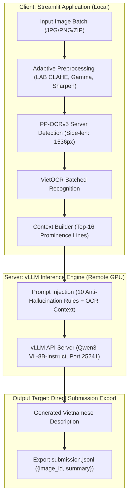

# Team ArrayOfSunshine
## Phase 3: Multimodal Image Summarization Pipeline
### End-to-End OCR and Vision-Language Model Architecture for FMCG Image Description

> Competition: The 2nd URA Hackathon 2026 (Phase 3)  
> Task: Automated generation of accurate, hallucination-free Vietnamese summaries for social media FMCG product images.

---

## 1. Executive Summary

This repository presents the official Phase 3 solution from Team ArrayOfSunshine. The system transitions from structured CSV extraction to context-aware free-text Vietnamese summarization in standard JSONL format.

The architecture operates as a decoupled client-server system:
1. Client Side (Streamlit Interface): Performs image enhancement, local OCR (PaddleOCR detection + VietOCR recognition), interactive visualization, and direct export of `submission.jsonl`.
2. High-Throughput VLM Server (Remote Dedicated GPU): Serves Qwen3-VL-8B-Instruct via vLLM, incorporating OCR-gated empty checks and a prominence-ranked prompt injection framework to eliminate hallucinations.
3. Concurrent Processing: Asynchronous multi-threaded engine overlapping local OCR with remote GPU inference to process image batches smoothly without blocking the UI.

---

## 2. Evaluation Metrics and Constraints

| Metric | Evaluation Method | Objective and Rule |
|---|---|---|
| Brand and Product F1 | Token-level Precision and Recall against Ground Truth | Accurate extraction of brand and product names embedded naturally in text. |
| Anti-Hallucination | LLM-as-a-Judge penalty scoring | Strict penalty on fabricated brands, incorrect products, or ungrounded details. |
| Empty Image Contract | Exact match validation | Images devoid of text, branding, or products must return an exact empty string `""`. |

---

## 3. End-to-End Pipeline Architecture



### Pipeline Workflow:
1. Local Adaptive Preprocessing: Evaluates image lighting and applies targeted CLAHE (LAB color space) and unsharp masking.
2. Local OCR Engine:
   * Text Detection: PP-OCRv5 server detection model with reading-order polygon sorting.
   * Text Recognition: VietOCR transformer model reading cropped text boxes.
3. Remote VLM Summarization:
   * Formats prompt with ranked OCR context and 10 anti-hallucination rules.
   * Sends image and context to the remote GPU running Qwen3-VL-8B via vLLM.
4. Submission Generation:
   * Real-time generation of contextual summaries.
   * Exports valid `submission.jsonl` adhering to the contest schema.

---

## 4. Hardware and Environment Specification

### Local Client (Streamlit App):
* Hardware: Standard PC / Laptop (CPU or entry-level GPU).
* Tasks: Runs Streamlit web UI, image loading, PaddleOCR detection, VietOCR recognition, and file saving.

### Remote Server (vLLM Engine):
* Hardware: Dedicated Linux GPU Server (NVIDIA H100 20GB MIG).
* Tasks: High-throughput vLLM OpenAI-compatible server hosting Qwen3-VL-8B-Instruct.
* Connectivity: Exposed via encrypted HTTPS tunnel (ngrok / reverse tunnel).

---

## 5. Prompt Engineering and Anti-Hallucination Framework

The prompt is formulated entirely in Vietnamese to maximize native semantic coherence:

```text
Bạn viết mô tả ngắn cho ảnh thu thập từ mạng xã hội Việt Nam.

## Nhiệm vụ
Viết một đoạn mô tả ngắn gọn bằng tiếng Việt CÓ DẤU về nội dung ảnh.

## Quy tắc bắt buộc
1. Nêu bối cảnh chính: ảnh sản phẩm, banner quảng cáo, ảnh livestream, ảnh review, ảnh chụp màn hình, ảnh phong cảnh, ảnh người...
2. TÊN NHÃN HÀNG và TÊN SẢN PHẨM: giữ nguyên chính tả và nguyên ký tự đúng như xuất hiện trong ảnh.
3. CÁC DÒNG CHỮ KHÁC: diễn đạt lại ý bằng lời của bạn. KHÔNG trích dẫn nguyên văn, KHÔNG dùng dấu ngoặc kép, KHÔNG chép lại từng dòng chữ.
4. Nếu một dòng OCR đọc ra vô nghĩa, sai chính tả nặng hoặc không thành câu: BỎ QUA hoàn toàn.
5. Chỉ mô tả những gì CÓ trong ảnh. KHÔNG viết câu nói rằng ảnh không có hoặc thiếu thứ gì.
6. Viết khẳng định. KHÔNG dùng "có thể là", "có vẻ", "dường như", "không rõ", ...
7. KHÔNG bịa nhãn hàng, sản phẩm, giá, con số hay chương trình khuyến mãi không nhìn thấy trong ảnh.
8. KHÔNG nhắc đến nhiệm vụ này và KHÔNG dùng các từ như FMCG, OCR, "hình ảnh này", "mô tả".
9. Nếu ảnh KHÔNG có chữ đọc được VÀ KHÔNG có nhãn hàng/sản phẩm: trả về chuỗi rỗng.
10. Chỉ xuất đúng đoạn mô tả. Không dẫn dắt, không dùng ngoặc kép bao quanh, không định dạng markdown.

## Kết quả OCR của ảnh này (chỉ để tham khảo, có thể sai):
__OCR_CONTEXT__

Nhắc lại: nếu ảnh không có chữ đọc được và không có nhãn hàng/sản phẩm, trả về chuỗi rỗng.
Viết mô tả ngay.
```

---

## 6. Submission Output Specification

The output file `submission.jsonl` complies strictly with the UTF-8 JSON Lines contest schema where each row has exactly two keys:

```jsonl
{"image_id": "priv_d_0030", "summary": "Banner quảng cáo chương trình khuyến mãi mua 2 tặng 1 của Nestlé Milo trên nền xanh lá."}
{"image_id": "priv_d_0031", "summary": ""}
{"image_id": "priv_d_0032", "summary": "Ảnh chụp hộp sữa tươi tiệt trùng Vinamilk Flex không đường dung tích 180ml."}
```

---
Developed by Team ArrayOfSunshine for The 2nd URA Hackathon 2026.
