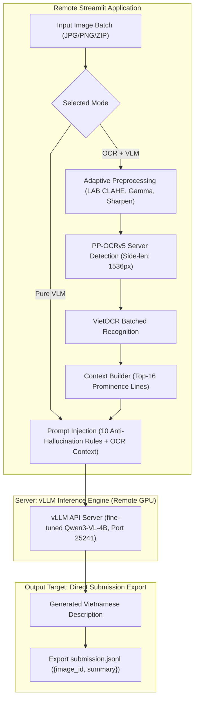

# Team ArrayOfSunshine
## Phase 3: Multimodal Image Summarization Pipeline
### End-to-End OCR and Vision-Language Model Architecture for FMCG Image Description

> Competition: The 2nd URA Hackathon 2026 (Phase 3)  
> Task: Automated generation of accurate, hallucination-free Vietnamese summaries for social media FMCG product images.

---

## 1. Executive Summary

This repository presents the official Phase 3 solution from Team ArrayOfSunshine. The system transitions from structured CSV extraction to context-aware free-text Vietnamese summarization in standard JSONL format.

The current deployment runs the UI, optional OCR, and vLLM on one remote server while keeping separate CPU and GPU processes:

1. Streamlit Interface: Accepts individual images, multiple files, or ZIP archives and exports `submission.jsonl`.
2. Pure VLM Mode: Sends original images directly to the fine-tuned Qwen3-VL-4B endpoint. This is the default path and supports six concurrent HTTP requests.
3. OCR + VLM Mode: Optionally performs enhancement, PaddleOCR detection, VietOCR recognition, and prominence-ranked OCR context injection before VLM inference.
4. vLLM Server: Loads the merged checkpoint under model ID `fmcg-qwen3-vl-4b-lora` and keeps the API private on localhost.

---

## 2. Evaluation Metrics and Constraints

| Metric | Evaluation Method | Objective and Rule |
|---|---|---|
| Gate F1 | Non-empty versus exact empty output | Measures FMCG-presence classification without inventing entity annotations. |
| Negative Rejection Accuracy | Exact empty-string match on ABSENT images | Penalizes false brand or product descriptions on negative images. |
| PRESENT-only Macro Token F1 | Token overlap against audited positive references | Measures description similarity without allowing correct empty outputs to inflate the result. |
| Output Format Compliance | Deterministic string checks | Rejects markdown, wrappers, meta commentary, and extra whitespace. |

The measured 4B results and metric definitions are in `LORA_TRAINING_REPORT.md`. Brand Exact Match is not reported because the validation metadata has no audited brand spans.

---

## 3. End-to-End Pipeline Architecture



### Pipeline Workflow:

1. Pure VLM path: Sends the original image directly to the fine-tuned 4B endpoint without OCR.
2. Optional adaptive preprocessing: Evaluates image lighting and applies targeted CLAHE and unsharp masking.
3. Optional OCR engine:
   * Text Detection: PP-OCRv5 server detection model with reading-order polygon sorting.
   * Text Recognition: VietOCR transformer model reading cropped text boxes.
4. VLM summarization:
   * Formats prompt with ranked OCR context and 10 anti-hallucination rules.
   * Sends image and context to the remote GPU running the fine-tuned Qwen3-VL-4B via vLLM.
5. Submission generation:
   * Real-time generation of contextual summaries.
   * Exports valid `submission.jsonl` adhering to the contest schema.

---

## 4. Hardware and Environment Specification

### Remote server

* Hardware: Linux server with NVIDIA H100 20GB MIG and four CPU cores available to the container.
* CPU tasks: Streamlit, optional PaddleOCR/VietOCR, image loading, and output generation.
* GPU task: vLLM OpenAI-compatible endpoint for the fine-tuned Qwen3-VL-4B model.
* Connectivity: Only Streamlit port 8501 is exposed through ngrok. The vLLM API remains on `127.0.0.1:25241`.

---

## 5. Prompt Engineering and Anti-Hallucination Framework

The prompt is formulated entirely in Vietnamese to maximize native semantic coherence:

```text
Bạn viết mô tả ngắn cho ảnh thu thập từ mạng xã hội Việt Nam.

## Nhiệm vụ
Viết một đoạn mô tả ngắn gọn bằng tiếng Việt CÓ DẤU về nội dung ảnh.

## Quy tắc bắt buộc
1. Nêu bối cảnh chính: ảnh sản phẩm, banner quảng cáo, ảnh livestream, ảnh review, ảnh chụp màn hình, ảnh phong cảnh, ảnh người...
2. TÊN NHÃN HÀNG và TÊN SẢN PHẨM: giữ nguyên chính tả và nguyên ký tự đúng như xuất hiện trong ảnh.
3. CÁC DÒNG CHỮ KHÁC: diễn đạt lại ý bằng lời của bạn. KHÔNG trích dẫn nguyên văn, KHÔNG dùng dấu ngoặc kép, KHÔNG chép lại từng dòng chữ.
4. Nếu một dòng OCR đọc ra vô nghĩa, sai chính tả nặng hoặc không thành câu: BỎ QUA hoàn toàn.
5. Chỉ mô tả những gì CÓ trong ảnh. KHÔNG viết câu nói rằng ảnh không có hoặc thiếu thứ gì.
6. Viết khẳng định. KHÔNG dùng "có thể là", "có vẻ", "dường như", "không rõ", ...
7. KHÔNG bịa nhãn hàng, sản phẩm, giá, con số hay chương trình khuyến mãi không nhìn thấy trong ảnh.
8. KHÔNG nhắc đến nhiệm vụ này và KHÔNG dùng các từ như FMCG, OCR, "hình ảnh này", "mô tả".
9. Nếu ảnh KHÔNG có chữ đọc được VÀ KHÔNG có nhãn hàng/sản phẩm: trả về chuỗi rỗng.
10. Chỉ xuất đúng đoạn mô tả. Không dẫn dắt, không dùng ngoặc kép bao quanh, không định dạng markdown.

## Kết quả OCR của ảnh này (chỉ để tham khảo, có thể sai):
__OCR_CONTEXT__

Nhắc lại: nếu ảnh không có chữ đọc được và không có nhãn hàng/sản phẩm, trả về chuỗi rỗng.
Viết mô tả ngay.
```

---

## 6. Submission Output Specification

The output file `submission.jsonl` complies strictly with the UTF-8 JSON Lines contest schema where each row has exactly two keys:

```jsonl
{"image_id": "priv_d_0030", "summary": "Banner quảng cáo chương trình khuyến mãi mua 2 tặng 1 của Nestlé Milo trên nền xanh lá."}
{"image_id": "priv_d_0031", "summary": ""}
{"image_id": "priv_d_0032", "summary": "Ảnh chụp hộp sữa tươi tiệt trùng Vinamilk Flex không đường dung tích 180ml."}
```

---
Developed by Team ArrayOfSunshine for The 2nd URA Hackathon 2026.
